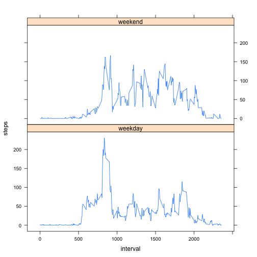

Reproducible Research : Assignment 1
========================================================

# Loading and preprocessing the data
The data is available on the same folder as the Rmd file. We use to following code to load the data and convert dat to Date format.

```r
dat = read.csv("activity.csv")
dat$date = as.Date(dat$date, format = "%Y-%m-%d")
str(dat)
```

```
## 'data.frame':	17568 obs. of  3 variables:
##  $ steps   : int  NA NA NA NA NA NA NA NA NA NA ...
##  $ date    : Date, format: "2012-10-01" "2012-10-01" ...
##  $ interval: int  0 5 10 15 20 25 30 35 40 45 ...
```

# What is mean total number of steps taken per day?
To plot the histogram and find out the **mean** and **median** total number of steps per day, we use the following codes:

```r
totalStepsDay = aggregate(dat$steps, by=list(dat$date), sum,na.rm=T)
plot(totalStepsDay,type='h')
```

 

```r
meanStepsDay = mean(totalStepsDay[,2],na.rm=T)
medianStepsDay = median(totalStepsDay[,2],na.rm=T)
```

The **mean** total number of steps per day is 9354.2295, and the **median** total number of steps per day is 10395.

# What is the average daily activity pattern?
We use the following codes to plot the  5-minute interval (x-axis) and the average number of steps taken, averaged across all days (y-axis), and to determine the interval containing the maximum number of steps:


```r
meanStepsInterval = aggregate(dat$steps, by=list(dat$interval), mean,na.rm=T)
names(meanStepsInterval)=c("Interval", "Average Steps")
plot(meanStepsInterval,type='l')
```

 

```r
maxInterval = meanStepsInterval$Interval[which.max(meanStepsInterval$"Average Steps")]
```

The interval containing the maximum number of steps is 835.

# Imputing missing values

We first copied the data to a new variable named *dat1* that will be used for imputing the missing values. 


```r
dat1 = dat
numMissingValues = sum(is.na(dat1$steps))
```

The number of missing values is 2304, which is 13.1148% of total number of values available.

Next, we will impute these missing values with the mean value of the 5 minutes interval that we calculated before. The coding steps are described below:


```r
posMissingValue = which(is.na(dat1$steps))
intervalMissingValue = dat1$interval[posMissingValue]

for (ind in posMissingValue)
{
  dat1[ind,1] = meanStepsInterval$"Average Steps"[meanStepsInterval$Interval==dat1[ind,3]]
}
```

Now, we will use the new data *dat1*, which also includes the imputed values to plot the histogram and to calculate the **mean** and **median** total number of steps per day.


```r
totalStepsDay1 = aggregate(dat1$steps, by=list(dat1$date), sum)
plot(totalStepsDay1,type='h')
```

 

The plot is similar to the previous plot, without incorporting the missing values, except for the few days where the missing values are imputed.


```r
meanStepsDay1 = mean(totalStepsDay[,2],na.rm=T)
medianStepsDay1 = median(totalStepsDay[,2],na.rm=T)
```

The **mean** total number of steps per day is 9354.2295, and the **median** total number of steps per day is 10395, which are the same values as the previous one.

# Are there differences in activity patterns between weekdays and weekends?

To answer this question, we use the *weekday()* command to introduce a new factor variable *typeDay* in the data set. Next, we calculate the mean values as shown in the following code:


```r
dat1$typeDay = (weekdays(dat1$date)=="Sunday")|(weekdays(dat1$date)=="Saturday")
dat1$typeDay = factor(dat1$typeDay,labels=c("weekday","weekend"))
meanStepsIntervalDayType = aggregate(dat1$steps, by=list(dat1$interval,dat1$typeDay), mean)
names(meanStepsIntervalDayType) = c("interval", "typeDay", "steps")
```

To plot the results, we use the lattice package.

```r
library(lattice)
xyplot(steps~interval|typeDay, data=meanStepsIntervalDayType,type='l',layout=c(1,2))
```

 

From the plot, we observe that the activity pattens between weekdays and weekend are different.
